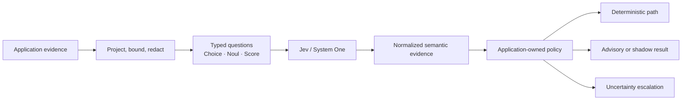

# TypeSafe AI Implementation Skill

> A practical engineering playbook for using Jev / System One typed judgments at
> bounded semantic decision points while keeping application authority in code.

**Start here:** [`SKILL.md`](skills/typesafe-ai-implementation/SKILL.md) · [Design references](skills/typesafe-ai-implementation/references/) ·
[Provenance](PROVENANCE.md) · [Official TypeSafe documentation](https://docs.typesafe.ai/llms.txt)

This Codex companion helps integrate TypeSafe AI's Jev model into applications; it does not replace the LLM
that powers Codex. For current API and primitive instructions, use TypeSafe's
[official agent skill](https://docs.typesafe.ai/agent-skill) and
[coding-agent guide](https://docs.typesafe.ai/introduction/coding-agents).

## ChatGPT and Codex plugin

This repository includes **TypeSafe AI Implementation**, a skills-based plugin for
ChatGPT and Codex in the desktop app. It packages this implementation playbook with
original ChatGPT-generated abstract circuit artwork. It helps an agent build applications
that use TypeSafe AI's Jev model; it does not replace the coding model or call the
TypeSafe API itself. The plugin is independent and not an official TypeSafe AI product or
endorsement. The product names are used only to describe compatibility; the artwork
contains no vendor logo or wordmark.

- Plugin package: [`plugins/typesafe-ai-implementation/`](plugins/typesafe-ai-implementation/)
- Repo marketplace: [`.agents/plugins/marketplace.json`](.agents/plugins/marketplace.json)
- Evolution record: [`EVOLUTION.md`](EVOLUTION.md)
- [OpenAI plugin packaging guide](https://developers.openai.com/plugins/build/plugins) ·
  [ChatGPT plugins documentation](https://learn.chatgpt.com/docs/plugins?surface=app)

To use it from a local checkout, open this repository in the ChatGPT/Codex desktop app,
then open **Plugins**, choose **TypeSafe AI Implementation**, install **TypeSafe AI Implementation**,
and start a new chat or Codex task. The repo-scoped marketplace definition is at
`.agents/plugins/marketplace.json`. This is repository marketplace distribution;
appearing in the public Plugins Directory requires the separate OpenAI submission and
review process.

### Public Plugins Directory submission

This local marketplace package is not a public listing. OpenAI accepts skills-only
plugins, so this package does not need an MCP server. The public submission ZIP should
contain the plugin root (including `plugin.json`, `.codex-plugin/plugin.json`, `skills/`,
and `assets/`) without the repository marketplace. OpenAI's portal validates the upload,
scans the skill, and collects the remaining listing and test materials.

The current [skills-only ZIP](marketplace-submission/typesafe-ai-implementation-0.1.3.zip),
[listing draft](marketplace-submission/listing-draft.md), [privacy policy draft](marketplace-submission/privacy-policy.md),
[release notes](marketplace-submission/release-notes.md), and [test cases](marketplace-submission/test-cases.md)
are prepared in `marketplace-submission/`. Rebuild the ZIP after package edits with
`python marketplace-submission/build_zip.py`.

Before submission, confirm a verified individual or business publisher identity and
**Apps Management: Write** access in the publishing organization. Prepare up to three
starter prompts, exactly five positive and three negative test cases, availability
regions, and release notes. Website, support, privacy, and terms URLs are optional for a
skills-only ZIP according to the submission error reference; OpenAI's privacy guidance
still expects a published privacy policy, so include one if available. Do not submit
URLs that are not live and accurate. OpenAI reviews the draft; approval is required
before the publisher can publish it to the universal Plugins Directory.

See OpenAI's [submission guide](https://developers.openai.com/plugins/deploy/submission),
[plugin guidelines](https://developers.openai.com/plugins/app-guidelines), and
[submission error reference](https://developers.openai.com/plugins/deploy/submission-errors).

## Summary

- **What it is:** a practical engineering guide for deciding where TypeSafe AI/Jev typed judgments belong in a real system.
- **Core rule:** use semantic models only at bounded judgment seams; keep validation, permissions, persistence, side effects, workflow state, and final policy in deterministic application code.
- **What it gives you:** question-selection guidance, bounded state projection, receipts/provenance, uncertainty handling, fallback patterns, and evaluation/promotion criteria.
- **What it is not:** an official TypeSafe AI artifact or endorsement.

This is an independent implementation guide maintained by **ngallodev-software**.
It is not an official TypeSafe AI skill, product, or endorsement. The guide combines
public TypeSafe documentation and SDK behavior with independently authored engineering
guidance. Third-party attribution is recorded in
[`THIRD_PARTY_NOTICES.md`](THIRD_PARTY_NOTICES.md).

## The approach

Use TypeSafe for a narrow judgment over supplied evidence. Let deterministic
application code retain validation, permissions, persistence, workflow state,
side effects, and final policy. The skill helps identify that boundary, design
questions, build bounded projections and receipts, handle uncertainty, and measure
the result before allowing evidence to influence behavior.

## What the skill covers

| Step | Engineering work |
| --- | --- |
| Find the seam | Distinguish deterministic rules, bounded semantic judgments, generative work, and authority-bearing decisions. |
| Prepare state | Select relevant facts, preserve provenance, redact secrets, bound payload size, and hash canonical requests when needed. |
| Ask typed questions | Use `Choice` for finite selections, `Noul` for one binary proposition, and `Score` for one ordered dimension. |
| Normalize evidence | Keep status, probability/distribution, confidence, model identity, source references, and versioned question sets in receipts. |
| Handle failure | Define no-match, uncertainty, transport failure, policy rejection, deterministic fallback, and human escalation separately. |
| Evaluate and promote | Start in shadow/advisory mode; compare against deterministic or human labels before changing behavior. |

The skill includes design references, provenance tags, evaluation patterns, and
offline scaffolding for Python and TypeScript. Its helpers do not call TypeSafe or
require an API key. See the [skill operating guide](skills/typesafe-ai-implementation/SKILL.md),
[reference map](skills/typesafe-ai-implementation/references/), and [offline scripts](skills/typesafe-ai-implementation/scripts/).

## Public submission test cases

Draft starter test cases and expected behaviors for the public plugin review are in
[`marketplace-submission/test-cases.md`](marketplace-submission/test-cases.md). They are
review materials for the skills-only listing and do not require an API key or a live
TypeSafe account.

## Attribution and source material

TypeSafe AI and Jev provide System One and the typed semantic API. Use the current
vendor documentation and SDK as the authority for product behavior; this skill is
implementation guidance, not an official TypeSafe product or an endorsement by
TypeSafe AI.

- [Jev and System One announcement](https://typesafe.ai/blog/introducing-system-one-models-and-jev)
- [System One concepts](https://docs.typesafe.ai/concepts/system-one.md) · [state](https://docs.typesafe.ai/concepts/state.md) · [building guide](https://docs.typesafe.ai/concepts/how-to-build-with-system-one.md)
- [Choice](https://docs.typesafe.ai/primitives/choice.md) · [Noul](https://docs.typesafe.ai/primitives/noul.md) · [Score](https://docs.typesafe.ai/primitives/score.md)
- [Python SDK](https://docs.typesafe.ai/sdk/python.md) · [official Python SDK source](https://github.com/typesafe-ai/typesafe-sdk-python) · [TypeSafe skills](https://github.com/typesafe-ai/skills)

This independent implementation guide is maintained by **ngallodev-software**.
Vendor behavior is linked to TypeSafe sources; engineering recommendations are clearly
identified as guidance rather than vendor guarantees.
