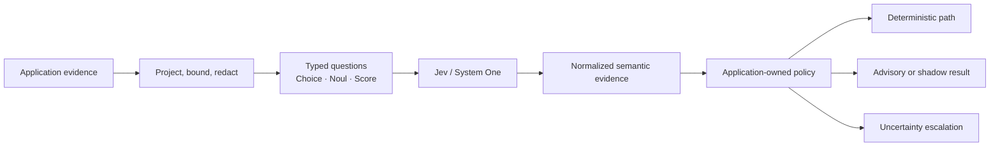

# TypeSafe AI Implementation Skill

> A practical engineering playbook for using Jev / System One typed judgments at
> bounded semantic decision points while keeping application authority in code.

**Start here:** [`SKILL.md`](skills/typesafe-ai-implementation/SKILL.md) · [Design references](skills/typesafe-ai-implementation/references/) ·
[Provenance](PROVENANCE.md) · [Official TypeSafe documentation](https://docs.typesafe.ai/llms.txt)

This Codex companion helps integrate Jev into applications; it does not replace the LLM
that powers Codex. For current API and primitive instructions, use TypeSafe's
[official agent skill](https://docs.typesafe.ai/agent-skill) and
[coding-agent guide](https://docs.typesafe.ai/introduction/coding-agents).

**Portfolio context:** [Agent-Workflow TypeSafe AI case study](https://ngallodev-software.uk/projects/agent-workflow-typesafe-ai)

## ChatGPT and Codex plugin

This repository includes **Jev AI Implementation**, a skills-based plugin for ChatGPT
and Codex in the ChatGPT desktop app. It packages this implementation playbook with the
Jev icon; it helps an agent build applications that call Jev and does not replace the
coding model or call the TypeSafe API itself.

- Plugin package: [`plugins/typesafe-ai-implementation/`](plugins/typesafe-ai-implementation/)
- Repo marketplace: [`.agents/plugins/marketplace.json`](.agents/plugins/marketplace.json)
- Evolution record: [`EVOLUTION.md`](EVOLUTION.md)
- [OpenAI plugin packaging guide](https://developers.openai.com/plugins/build/plugins) ·
  [ChatGPT plugins documentation](https://learn.chatgpt.com/docs/plugins?surface=app)

To use it from a local checkout, open this repository in the ChatGPT/Codex desktop app,
then open **Plugins**, choose **Jev Implementation**, install **Jev AI Implementation**,
and start a new chat or Codex task. The repo-scoped marketplace definition is at
`.agents/plugins/marketplace.json`. This is repository marketplace distribution;
appearing in the public Plugins Directory requires the separate OpenAI submission and
review process.

## Summary

- **What it is:** a practical engineering guide for deciding where TypeSafe AI/Jev typed judgments belong in a real system.
- **Core rule:** use semantic models only at bounded judgment seams; keep validation, permissions, persistence, side effects, workflow state, and final policy in deterministic application code.
- **What it gives you:** question-selection guidance, bounded state projection, receipts/provenance, uncertainty handling, fallback patterns, and evaluation/promotion criteria.
- **What it is not:** an official TypeSafe AI artifact or endorsement.

This is an independent implementation guide maintained by **ngallodev-software**.
It is not an official TypeSafe AI skill, product, or endorsement. The repository
combines public TypeSafe documentation and SDK behavior with independently authored
engineering guidance and project-specific analysis of public ngallodev-software
repositories. Third-party attribution is recorded in
[`THIRD_PARTY_NOTICES.md`](THIRD_PARTY_NOTICES.md).

## The approach

Use TypeSafe for a narrow judgment over supplied evidence. Let deterministic
application code retain validation, permissions, persistence, workflow state,
side effects, and final policy. The skill helps identify that boundary, design
questions, build bounded projections and receipts, handle uncertainty, and measure
the result before allowing evidence to influence behavior.

## What the skill covers

| Step | Engineering work |
| --- | --- |
| Find the seam | Distinguish deterministic rules, bounded semantic judgments, generative work, and authority-bearing decisions. |
| Prepare state | Select relevant facts, preserve provenance, redact secrets, bound payload size, and hash canonical requests when needed. |
| Ask typed questions | Use `Choice` for finite selections, `Noul` for one binary proposition, and `Score` for one ordered dimension. |
| Normalize evidence | Keep status, probability/distribution, confidence, model identity, source references, and versioned question sets in receipts. |
| Handle failure | Define no-match, uncertainty, transport failure, policy rejection, deterministic fallback, and human escalation separately. |
| Evaluate and promote | Start in shadow/advisory mode; compare against deterministic or human labels before changing behavior. |

The skill includes design references, provenance tags, evaluation patterns, and
offline scaffolding for Python and TypeScript. Its helpers do not call TypeSafe or
require an API key. See the [skill operating guide](skills/typesafe-ai-implementation/SKILL.md),
[reference map](skills/typesafe-ai-implementation/references/), and [offline scripts](skills/typesafe-ai-implementation/scripts/).

## Where the ideas are applied

The projects below show how the bounded-evidence pattern was adapted to real host
and evaluation contracts. Their authority remains with the consuming application.

| Project | Integration | Boundary |
| --- | --- | --- |
| [Agent-Workflow](https://github.com/ngallodev-software/agent-workflow) | Built-in optional provider for route task class (`Choice`), interaction need (`Noul`), and semantic risk (`Score`). | Agent-Workflow applies configured policy and retains route enforcement, fallback, lifecycle, review, and acceptance. See its [TypeSafe integration guide](https://github.com/ngallodev-software/agent-workflow#optional-bounded-semantic-decisions) and [provider source](https://github.com/ngallodev-software/agent-workflow/blob/master/src/agent_workflow/semantic/typesafe.py). |
| [Agent-Workflow TypeSafe adapter](https://github.com/ngallodev-software/agent-workflow-typesafe-ai) | Optional external plugin with routing and skill-behavior question sets, compatibility checks, semantic receipts, and bounded opt-in call logging. | The adapter exposes evidence through the host plugin API; it does not own application thresholds or workflow actions. The current benchmark runtime uses Agent-Workflow's built-in provider rather than this standalone package. |
| [Agent-Workflow Benchmark](https://github.com/ngallodev-software/agent-workflow-benchmark) | Runs pre-treatment route qualification, advisory matched-file source review, and optional post-seal `typesafe-batch` score probes. | Qualification is excluded from paired treatments; advisory review preserves deterministic findings; batch probes run after execution sealing. |
| [Comparative Evaluation](https://github.com/ngallodev-software/agent-workflow-comparative-eval) | Supplies neutral observation, cohort, metrics, and statistics contracts. | The library does not call TypeSafe or own Agent-Workflow lifecycle. |
| [Benchmark Results](https://github.com/ngallodev-software/agent-workflow-benchmark-results) | Publishes sanitized qualification summaries and paired benchmark evidence. | Current BM3–BM5 evidence is single-pair development data; it cannot establish a generalized winner or a causal TypeSafe effect. |

The Agent-Workflow reference in this skill is project-specific. The
[SpecGen-AW reference](skills/typesafe-ai-implementation/references/11-specgen-integration.md) describes design
opportunities and boundaries; it should not be read as a claim that every proposed
integration has shipped.

## What the benchmark evidence says

BM3, BM4, and BM5 each recorded three successful pre-treatment routing calls—one
per phase, each asking the three route questions. BM3 showed one task-class
disagreement under shadow policy and risk-score uncertainty fallbacks in all three
phases. BM4 and BM5 matched deterministic route recommendations in all phases.
These calls were excluded from the paired treatments, so the qualification data
measures adapter behavior, not benchmark treatment quality or efficiency.

BM4 also published a separate advisory TypeSafe review over seven matched source
files: seven requests, 38,295 input tokens, 1,190 output tokens, and 1.601 seconds
reported service duration using Jev `jev-1.13.0`. Aggregate estimates were 63.25
for structured direct and 58.80 for Agent-Workflow optimized. Those estimates are
not machine scores, human review, or acceptance evidence. Read the
[BM3](https://github.com/ngallodev-software/agent-workflow-benchmark-results/tree/main/bm3),
[BM4](https://github.com/ngallodev-software/agent-workflow-benchmark-results/tree/main/bm4),
and [BM5](https://github.com/ngallodev-software/agent-workflow-benchmark-results/tree/main/bm5)
study pages for full metrics and limitations.

## Attribution and source material

TypeSafe AI and Jev provide System One and the typed semantic API. Use the current
vendor documentation and SDK as the authority for product behavior; this skill is
implementation guidance, not an official TypeSafe product or an endorsement by
TypeSafe AI.

- [Jev and System One announcement](https://typesafe.ai/blog/introducing-system-one-models-and-jev)
- [System One concepts](https://docs.typesafe.ai/concepts/system-one.md) · [state](https://docs.typesafe.ai/concepts/state.md) · [building guide](https://docs.typesafe.ai/concepts/how-to-build-with-system-one.md)
- [Choice](https://docs.typesafe.ai/primitives/choice.md) · [Noul](https://docs.typesafe.ai/primitives/noul.md) · [Score](https://docs.typesafe.ai/primitives/score.md)
- [Python SDK](https://docs.typesafe.ai/sdk/python.md) · [official Python SDK source](https://github.com/typesafe-ai/typesafe-sdk-python) · [TypeSafe skills](https://github.com/typesafe-ai/skills)

The integration patterns and project analysis in this repository are maintained
by **ngallodev-software**. Vendor facts are linked to TypeSafe sources; original
project guidance and project-specific analysis are labeled separately from vendor
contracts so readers can distinguish sourced behavior from engineering judgment.
