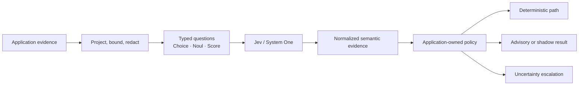

  

<h1 align="center">TypeSafe AI Implementation Skill</h1>

<strong>A practical engineering playbook for using Jev/System One at bounded semantic decision seams while keeping application authority in code.</strong>

  <a href="https://ngallodev-software.uk/">Portfolio</a> ·
  <a href="https://ngallodev-software.uk/projects/agent-workflow-typesafe-ai">TypeSafe/Jev case study</a> ·
  <a href="https://jevhunt.com/projects/ngallodev-software/typesafe-ai-implementation-skill/">JevHunt listing</a>

  
  
  

## Summary

> **Evidence & chronology:** this repository is part of the wider Agent-Workflow engineering ecosystem. A private `agent-workflow-lab-notebook` preserves dated decisions, failures, corrections, and evidence lineage; public README and portfolio claims are curated from public artifacts and reviewed notebook history. JevHunt is an independent discovery/indexing surface, not an endorsement or independent validation.

- **What it is:** a practical engineering guide for deciding where TypeSafe AI/Jev typed judgments belong in a real system.
- **Core rule:** use semantic models only at bounded judgment seams; keep validation, permissions, persistence, side effects, workflow state, and final policy in deterministic application code.
- **What it gives you:** question-selection guidance, bounded state projection, receipts/provenance, uncertainty handling, fallback patterns, and evaluation/promotion criteria.
- **What it is not:** an official TypeSafe AI artifact or endorsement.

This is an independent implementation guide maintained by **ngallodev-software**.
It is not an official TypeSafe AI skill, product, or endorsement. The guide combines
public TypeSafe documentation and SDK behavior with independently authored engineering
guidance. Third-party attribution is recorded in
[`THIRD_PARTY_NOTICES.md`](THIRD_PARTY_NOTICES.md).

## The approach

Use TypeSafe for a narrow judgment over supplied evidence. Let deterministic
application code retain validation, permissions, persistence, workflow state,
side effects, and final policy. The skill helps identify that boundary, design
questions, build bounded projections and receipts, handle uncertainty, and measure
the result before allowing evidence to influence behavior.

```mermaid
flowchart LR
    A[Application evidence] --> B[Project, bound, redact]
    B --> C[Typed questions<br/>Choice · Noul · Score]
    C --> D[Jev / System One]
    D --> E[Normalized semantic evidence]
    E --> F[Application-owned policy]
    F --> G[Deterministic path]
    F --> H[Advisory or shadow result]
    F --> I[Uncertainty escalation]
```

## What the skill covers

| Step | Engineering work |
| --- | --- |
| Find the seam | Distinguish deterministic rules, bounded semantic judgments, generative work, and authority-bearing decisions. |
| Prepare state | Select relevant facts, preserve provenance, redact secrets, bound payload size, and hash canonical requests when needed. |
| Ask typed questions | Use `Choice` for finite selections, `Noul` for one binary proposition, and `Score` for one ordered dimension. |
| Normalize evidence | Keep status, probability/distribution, confidence, model identity, source references, and versioned question sets in receipts. |
| Handle failure | Define no-match, uncertainty, transport failure, policy rejection, deterministic fallback, and human escalation separately. |
| Evaluate and promote | Start in shadow/advisory mode; compare against deterministic or human labels before changing behavior. |

The skill includes design references, provenance tags, evaluation patterns, and
offline scaffolding for Python and TypeScript. Its helpers do not call TypeSafe or
require an API key. See the [skill operating guide](skills/typesafe-ai-implementation/SKILL.md),
[reference map](skills/typesafe-ai-implementation/references/), and [offline scripts](skills/typesafe-ai-implementation/scripts/).

## Public submission test cases

Draft starter test cases and expected behaviors for the public plugin review are in
[`marketplace-submission/test-cases.md`](marketplace-submission/test-cases.md). They are
review materials for the skills-only listing and do not require an API key or a live
TypeSafe account.

## Attribution and source material

TypeSafe AI and Jev provide System One and the typed semantic API. Use the current
vendor documentation and SDK as the authority for product behavior; this skill is
implementation guidance, not an official TypeSafe product or an endorsement by
TypeSafe AI.

- [Jev and System One announcement](https://typesafe.ai/blog/introducing-system-one-models-and-jev)
- [System One concepts](https://docs.typesafe.ai/concepts/system-one.md) · [state](https://docs.typesafe.ai/concepts/state.md) · [building guide](https://docs.typesafe.ai/concepts/how-to-build-with-system-one.md)
- [Choice](https://docs.typesafe.ai/primitives/choice.md) · [Noul](https://docs.typesafe.ai/primitives/noul.md) · [Score](https://docs.typesafe.ai/primitives/score.md)
- [Python SDK](https://docs.typesafe.ai/sdk/python.md) · [official Python SDK source](https://github.com/typesafe-ai/typesafe-sdk-python) · [TypeSafe skills](https://github.com/typesafe-ai/skills)

This independent implementation guide is maintained by **ngallodev-software**.
Vendor behavior is linked to TypeSafe sources; engineering recommendations are clearly
identified as guidance rather than vendor guarantees.
